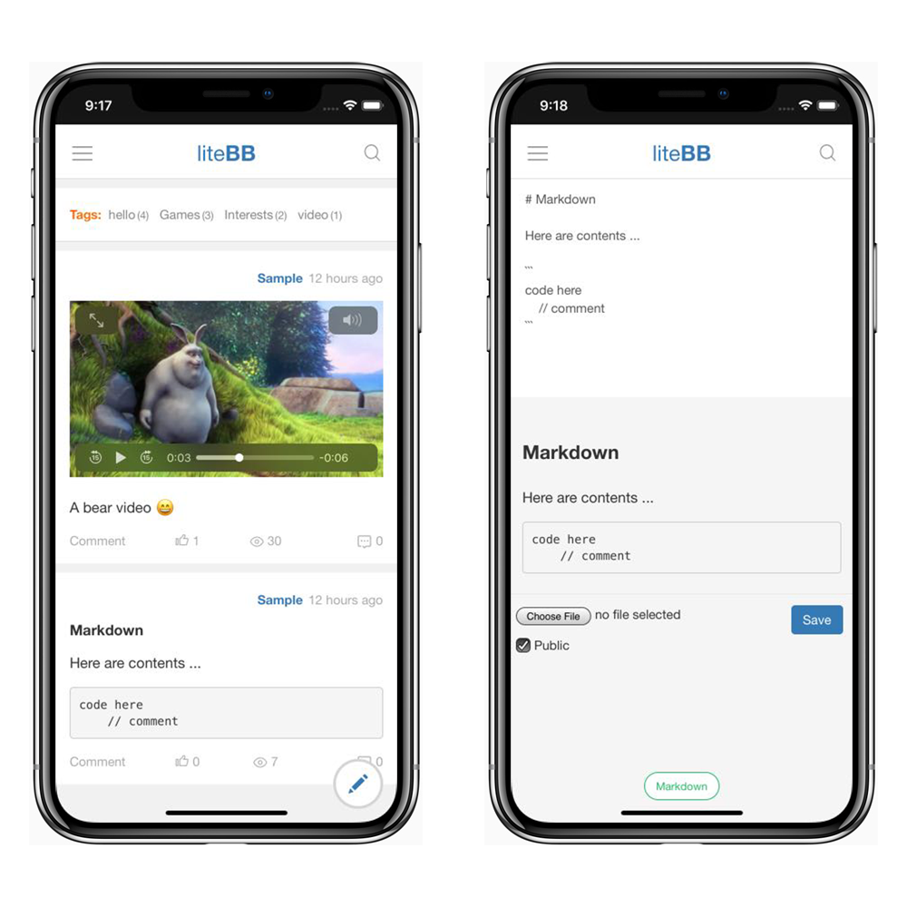

# liteBB

liteBB is a lite Blog & Board on mobile.

* Mobile first
* lite and Powerful
* Post text, image, video and file
* Markdown & real-time preview
* i18n Support
* PWA standalone mode (Android and iOS12)

# Quickstart

Clone or download liteBB, only 2 steps to start with Python 3:

    pip install -r requirements.txt
    python manage.py runserver --host 0.0.0.0 --port=80

Visit http://127.0.0.1/ or server address, the default User/Password is `admin/admin`.

***

Suggestions for liteBB deployment:

1. Create a virtualenv
2. Run liteBB with Gunicorn, or Gunicorn and Nginx
3. Install MySQL for liteBB (default is SQLite)
4. Enforce HTTPS (PWA required)

# Screenshots

# License

liteBB is licensed under the [CC-BY-SA 4.0](http://creativecommons.org/licenses/by-sa/4.0/), the attribution requires the following foot-note:

    Powered by <a href="https://litebb.com">liteBB</a>

# Links

* [liteBB](https://litebb.com)
